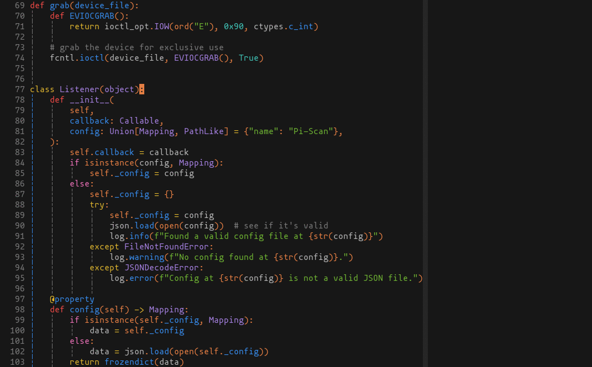

# selenized.nvim
The [Selenized](https://github.com/jan-warchol/selenized) colorscheme, adapted
for Neovim using [Lush](https://github.com/rktjmp/lush.nvim).



## About
See [Jan Warchoł's repo](https://github.com/jan-warchol/selenized) for in-depth
information on the actual colorscheme. All colors used are pulled directly, and
unchanged, from Jan's repo. The only thing I did was convert the HSB (aka, HSV)
values to HSL, for use with Lush.

The main purpose of this repo is to package the colorscheme as a regular Vim
plugin. Installation of the colorscheme from the original repo via a package
manager is troublesome. Packer.nvim can manage to install it properly via the
`rtp` option, but it is very difficult / impossible for simpler plugin managers
that can't add a subdirectory to the runtimepath.

This version also doesn't try to thematically match up colors with solarized.
In other words, selenized uses a different green than solarized does, but the
original repo tries to use its green where solarized uses green, blue where
solarized uses blue, etc. This version of the colorscheme doesn't try to do
that, because what drew me to the colorscheme was the readability / contrast
between the different colors, *not* the fact that it looks like solarized. The
colors used for each highlight group don't follow any rhyme or reason other
than my personal preference (which is likely subconsciously influenced by
One-Dark, the theme I used previously).

Finally, this version supports more highlight groups (diagnostics, Treesitter
groups, etc) and has some slightly saner defaults.

## Installation
Using packer.nvim:
```lua
use {
    'loganswartz/selenized.nvim',
    requires = {
        'rktjmp/lush.nvim',
    },
}
```

Using Vim-Plug:
```vim
Plug 'rktjmp/lush.nvim'
Plug 'loganswartz/selenized.nvim'
```

## Configuration
There are 2 different variants of the theme, and light or dark versions of each
of those. Set the variant using `g:selenized_variant`, and whether to use light
or dark with the `background` vim option:

```vim
" valid options are 'normal' (similar to solarized) or 'bw' (black/white variant)
" defaults to 'normal'
let g:selenized_variant = 'normal'

" can be 'dark' or 'light', usually defaults to 'dark'
set background=dark

" make sure to enable the colorscheme *after* setting the variant
colorscheme selenized
```

## Lualine
If you use Lualine, enable the corresponding Lualine theme like so:
```lua
-- example with packer.nvim
use {
    'nvim-lualine/lualine.nvim',
    config = function()
        require'lualine'.setup {
            options = {
                theme = "auto", -- or "selenized", but "auto" should pick it up.
                -- Omitting the "theme" option entirely will also default to "auto"
            },
        }
    end,
}
```
Using `theme = "auto"` means that the theme will automatically change when you
switch colorschemes (assuming a matching lualine theme is available), so you
can switch between colorschemes easily via `:colorscheme whatever` without
needing to go in and manually change the Lualine theme too. You can however
specify `theme = "selenized"` explicitly to always use the selenized lualine
theme regardless of the current vim theme.

## Support for old Treesitter groups
Version [63d4896](https://github.com/loganswartz/selenized.nvim/commit/63d4896d74be9aecd61df55a7c03bb45ad351a73)
of this plugin is the last version to use the old `TS*` style Treesitter
highlight groups. Going forward, we'll use the new group naming scheme.

This means using Treesitter-based highlights after commit
[63d4896](https://github.com/loganswartz/selenized.nvim/commit/63d4896d74be9aecd61df55a7c03bb45ad351a73)
will require Neovim 0.8+.
See [this comment](https://github.com/nvim-treesitter/nvim-treesitter/issues/2293#issuecomment-1279974776)
and [this commit](https://github.com/nvim-treesitter/nvim-treesitter/commit/42ab95d5e11f247c6f0c8f5181b02e816caa4a4f)
on nvim-treesitter for more info.

## Misc
The colors were ported from the main Selenized repo using
[convert.py](utils/convert.py), see usage [here](utils/).
